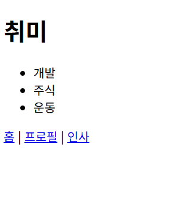

# HW1 — 나를 소개하는 미니 사이트

## 실행 방법
```
cd HW1
flask run
```

## 페이지
| 주소 | 내용 |
|---|---|
| `/` | 내 이름과 학번 |
| `/profile` | 취미 3가지 목록 |
| `/greet/<name>` | "안녕하세요, OOO님" |

## 실행 화면

### / (메인)


### /profile


### /greet/이름

