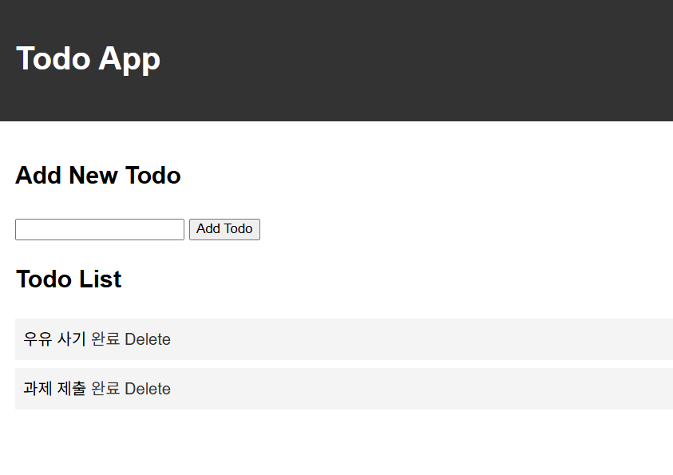
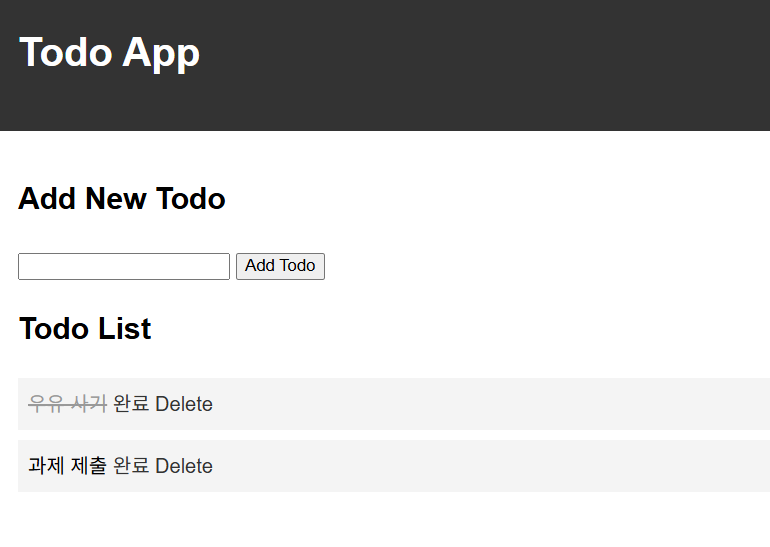
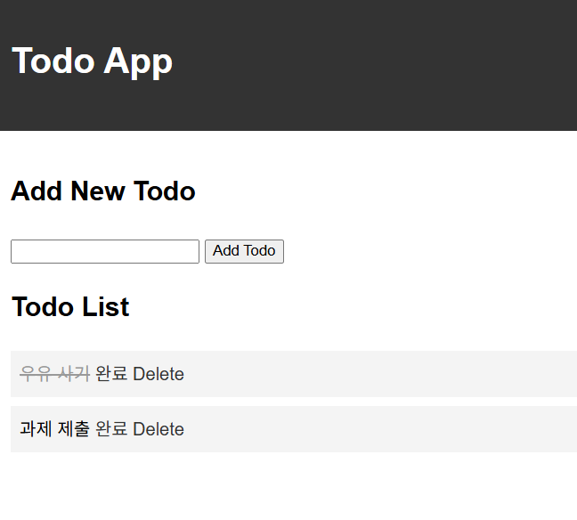

# HW2 — Todo 앱에 완료 체크 기능 추가

todo_app 을 복사해 완료 체크(toggle) 기능을 추가했습니다.

## 실행 방법
```
cd HW2
flask run
```

## 고친 곳
- `app.py` : `todos` 를 문자열 리스트 대신 `{'text': ..., 'done': False}` 딕셔너리 리스트로 변경, `/toggle/<int:index>` 라우트 추가
- `templates/index.html` : `todo.text` 로 출력, `done` 이면 취소선 클래스 적용, [완료] 링크 추가
- `static/style.css` : `.done` 클래스에 취소선(`text-decoration: line-through`) 추가

## 실행 화면

### 할 일 두 개가 있는 목록


### 하나를 [완료] 눌러 줄이 그어진 화면


### 새로고침한 뒤에도 줄이 남아 있는 화면

